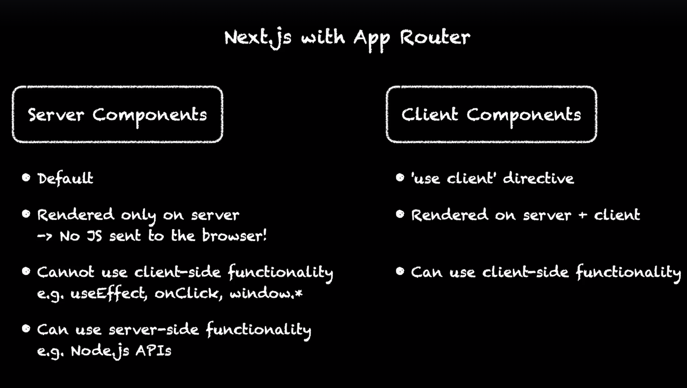

# Next Reviews

This is a sample application used in the [**Next.js by Example**](https://www.udemy.com/course/nextjs-by-example/?referralCode=590EBB6EDE0917E3CF58) course.

## Notes

- Prerendering: next js rendered the react components on the server and generates the html to send to the browser. It is the main feature of next js compared to traditional react app.
  - Faster Page Load, client side takes more time.
  - Search Engine Friendly.
  - Support NON-JS clients. (unless you want interactive web pages)
    - need to add `'use client'` to top of a component page that needs client side logic (like useEffect)

